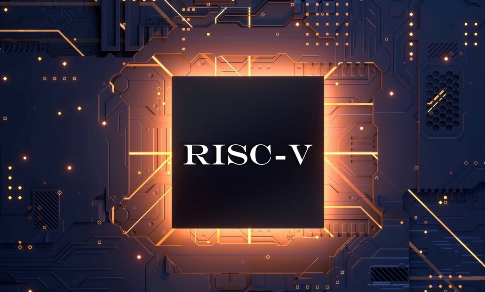

___
# RISC-V 32IM Pipelined Processor
___
## Why RISC-V Architecture?

RISC-V is a modern, open-source instruction set architecture (ISA) that is highly customizable, lightweight, and designed for flexibility. Unlike proprietary architectures, RISC-V enables developers to design hardware tailored to specific applications without licensing fees. Its modular design supports a wide range of devices, from microcontrollers to high-performance systems, while promoting innovation through open collaboration. Ideal for research, development, and commercial use, RISC-V is shaping the future of computing with its simplicity, scalability, and community-driven ecosystem.

## What is 32IM?
- __32__ indicates the __32-bit architecture__.Which means the processor uses 32-bit wide registers and supports 32-bit addresses and data widths.
- __I__ stands for __Base Integer Instruction Set__.
- __M__ stands for __Integer Multiplication and Division Extention__.

